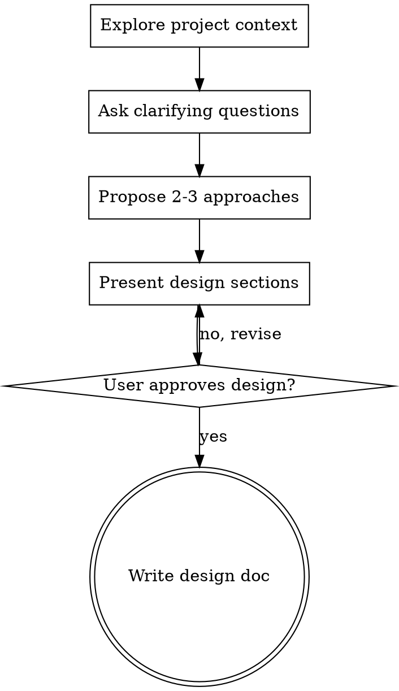

## What This Skill Does

Turns ideas into fully formed designs through natural collaborative dialogue. Understand the project context, ask questions one at a time to refine the idea, explore approaches, present a design, and write it up as a design doc.

## Workflow

### 1. Explore Project Context

Check out the current project state — files, docs, recent commits. Get grounded in what exists before proposing anything new.

### 2. Ask Clarifying Questions

- One question per message. If a topic needs more exploration, break it into multiple questions.
- Prefer multiple choice when possible, but open-ended is fine too.
- Focus on: purpose, constraints, success criteria.

### 3. Explore Approaches

- Propose 2-3 different approaches with trade-offs.
- Lead with your recommended option and explain why.
- Present options conversationally.

### 4. Present the Design

- Once you believe you understand what to build, present the design.
- Scale each section to its complexity: a few sentences if straightforward, up to 200-300 words if nuanced.
- Ask after each section whether it looks right so far.
- Cover as relevant: architecture, components, data flow, error handling, testing.
- Be ready to go back and revise if something doesn't land.

### 5. Write Design Doc

- Write the validated design to `docs/plans/YYYY-MM-DD-<topic>-design.md`.
- Commit the design document to git.
- This is the deliverable. The user decides what happens next.

## Process Flow

## Key Principles

- **One question at a time** — don't overwhelm with multiple questions
- **Multiple choice preferred** — easier to answer than open-ended when possible
- **YAGNI ruthlessly** — remove unnecessary features from all designs
- **Explore alternatives** — always propose 2-3 approaches before settling
- **Incremental validation** — present design in sections, get approval before moving on
- **Be flexible** — go back and clarify when something doesn't make sense
